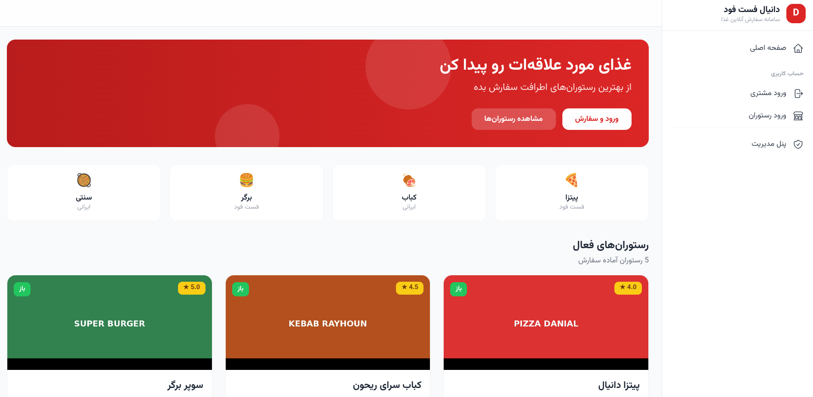
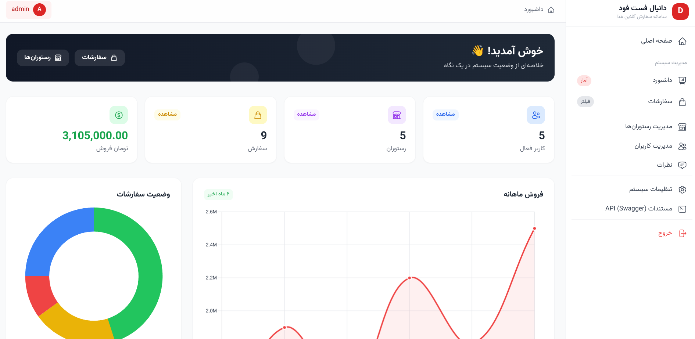
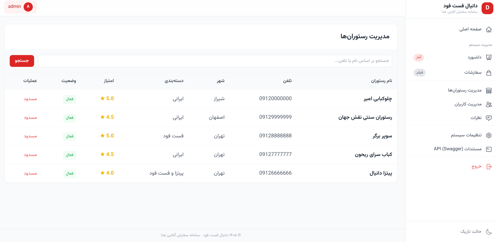
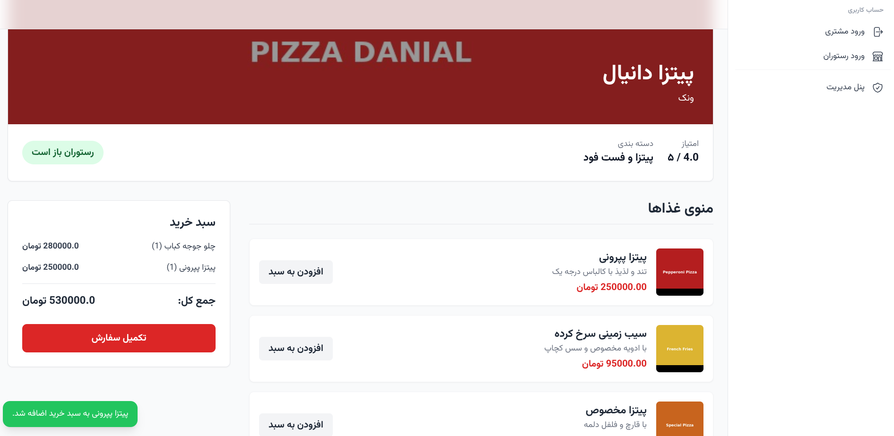

# دانیال فست فود — سامانه سفارش آنلاین غذا

پلتفرم جامع سفارش آنلاین غذا با پنل مدیریت، پنل رستوران، و اپلیکیشن مشتری. ساخته شده با Flask + Tailwind CSS + Alpine.js.






## قابلیت‌ها

### مشتری
- مشاهده رستوران‌های فعال اطراف
- مشاهده منوی غذا با تصاویر و قیمت‌ها
- سفارش غذا و پیگیری وضعیت
- ثبت نظر و امتیازدهی به رستوران‌ها
- تاریخچه سفارشات

### رستوران (پنل مدیریت غذا)
- داشبورد آماری با نمودار فروش
- مدیریت سفارشات (تایید، آماده‌سازی، تکمیل، لغو)
- مدیریت منوی غذا (افزودن، ویرایش، حذف با تصویر)
- گزارشات فروش روزانه/هفتگی/ماهانه
- ویرایش پروفایل رستوران
- مشاهده نظرات مشتریان

### مدیر سیستم
- داشبورد با نمودارهای فروش و وضعیت سفارشات
- مدیریت کاربران (جستجو، فیلتر، غیرفعال‌سازی)
- مدیریت رستوران‌ها (جستجو، فیلتر، تایید/مسدود)
- مدیریت سفارشات با فیلتر بر اساس وضعیت و رستوران
- مدیریت نظرات
- تنظیمات سیستم (دسته‌بندی غذا، شهرها، کارمزد)

### API (برای اپلیکیشن موبایل)
- ثبت‌نام و ورود کاربر و فروشنده (توکن‌محور)
- مشاهده رستوران‌ها و منوی غذا
- ثبت سفارش و پیگیری وضعیت
- مدیریت غذا و سفارشات توسط فروشنده
- مستندات Swagger در آدرس `/apidocs/`

## راهنمای نصب

### پیش‌نیازها
- Python 3.10+
- pip

### ۱. ایجاد محیط مجازی و نصب وابستگی‌ها

```bash
cd FlaskFoodFastDanial
python3 -m venv venv
source venv/bin/activate
pip install -r requirements.txt
```

### ۲. آماده‌سازی دیتابیس

```bash
python3 seed.py
```

این دستور دیتابیس را با داده‌های نمونه پر می‌کند: ۱ ادمین، ۵ کاربر، ۵ رستوران، ۱۰ غذا، ۹ سفارش، و ۸ نظر.

### ۳. اجرای سرور

```bash
python3 app.py
```

سرور در `http://127.0.0.1:5000` اجرا می‌شود.

## اطلاعات ورود پیش‌فرض

| نقش | آدرس | نام کاربری / تلفن | رمز عبور |
|-----|-------|-------------------|----------|
| **مدیر** | `/admin/login` | `admin` | `admin123` |
| **رستوران ۱** | `/seller/web/login` | `09126666666` | `seller123` |
| **رستوران ۲** | `/seller/web/login` | `09127777777` | `seller123` |
| **مشتری ۱** | `/login` | `09121111111` | `user123` |
| **مشتری ۲** | `/login` | `09122222222` | `user123` |

## مستندات API (Swagger)

پس از اجرای سرور، مستندات کامل API در آدرس زیر در دسترس است:

```
http://127.0.0.1:5000/apidocs/
```

۲۲ endpoint در ۴ دسته مستند شده است:
- **Auth** — ثبت‌نام و ورود
- **User API** — اندپوینت‌های مشتری (توکن لازم است)
- **Seller API** — اندپوینت‌های رستوران (توکن لازم است)
- **Admin API** — اندپوینت‌های مدیریت (session لازم است)

## ساختار پروژه

```
FlaskFoodFastDanial/
├── app.py                  # اپلیکیشن Flask
├── models.py               # مدل‌های SQLAlchemy
├── seed.py                 # داده‌های نمونه
├── requirements.txt        # وابستگی‌های Python
├── routes/
│   ├── auth_routes.py      # API احراز هویت
│   ├── user_api.py         # API مشتری
│   ├── seller_api.py       # API فروشنده
│   ├── admin_api.py        # API مدیریت
│   ├── web_user.py         # صفحات وب مشتری
│   ├── web_admin.py        # صفحات وب مدیریت
│   └── web_seller.py       # صفحات وب رستوران
├── utils/
│   ├── order_status.py     # ثابت‌های وضعیت سفارش
│   ├── decorators.py       # دکوراتورهای احراز هویت
│   ├── csrf.py             # مدیریت CSRF
│   └── pagination.py       # صفحه‌بندی
├── templates/
│   ├── base.html           # قالب پایه
│   ├── user/               # قالب‌های مشتری
│   ├── admin/              # قالب‌های مدیریت
│   ├── seller/             # قالب‌های رستوران
│   └── utils/              # ماکروهای Jinja2
└── static/
    ├── js/                 # Tailwind, Alpine.js, Chart.js
    ├── css/                # استایل‌های سفارشی
    ├── fonts/              # فونت Vazir
    ├── banner/             # تصاویر بنر رستوران‌ها
    └── food/               # تصاویر غذاها
```

## تکنولوژی‌ها

- **Backend:** Flask, SQLAlchemy, Flask-Migrate
- **Frontend:** Tailwind CSS, Alpine.js, Chart.js
- **Database:** SQLite
- **API Docs:** Flasgger (Swagger)
- **Font:** Vazirmatn (Persian)
- **Authentication:** Token-based (API) + Session-based (Web)
